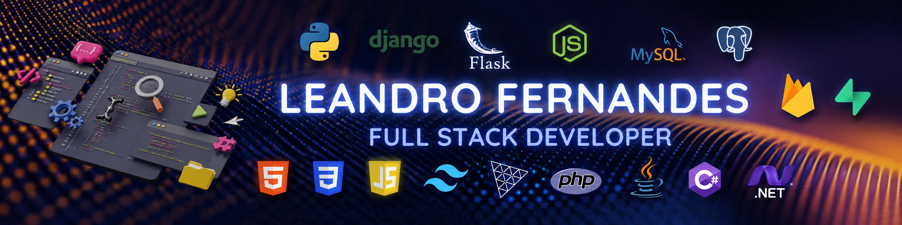

<div align="center">



<br>

# Olá, eu sou o Leandro 👋

### Desenvolvedor Full-Stack | Estudante de Engenharia de Software

Desenvolvo soluções com foco em **funcionalidade**, **segurança**,  
**clareza de código** e **experiência do usuário**.

<br>

<a href="https://leandro-fernandes-portfolio.vercel.app">
  
</a>

<a href="[www.linkedin.com/in/leandro-fernandes-951ab3189](https://www.linkedin.com/in/leandro-fernandes-951ab3189/)">
  
</a>

</div>

---

## 👨‍💻 Sobre mim

Sou desenvolvedor Full-Stack e estudante de Engenharia de Software, com experiência na construção e manutenção de aplicações, automações, integrações e soluções internas.

Profissionalmente, trabalho principalmente com **PHP**, **JavaScript**, **HTML**, **CSS**, **SQL** e **Oracle**. Em projetos pessoais, também utilizo tecnologias como **Python**, **Django**, **Flask**, **Supabase**, **Firebase**, **Three.js** e **GSAP**.

Atualmente, estou ampliando meus conhecimentos em **Java**, **C#** e **.NET**, além de aprofundar meus estudos em arquitetura de software, qualidade, segurança, documentação e organização de projetos.

Busco construir software que não apenas funcione, mas que também seja:

- seguro e confiável;
- claro e fácil de manter;
- bem documentado;
- organizado arquiteturalmente;
- responsivo e agradável para o usuário;
- preparado para evoluir sem depender de soluções improvisadas.

---

## 🧭 Princípios de desenvolvimento

Minha tomada de decisão durante o desenvolvimento segue, principalmente, esta ordem:

```text
1. Funcionalidade
2. Segurança
3. Clareza e manutenibilidade
4. Performance
5. Experiência do usuário
6. Elegância da implementação
